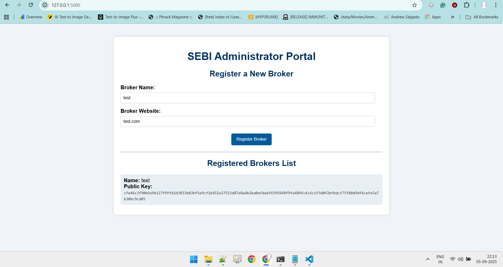
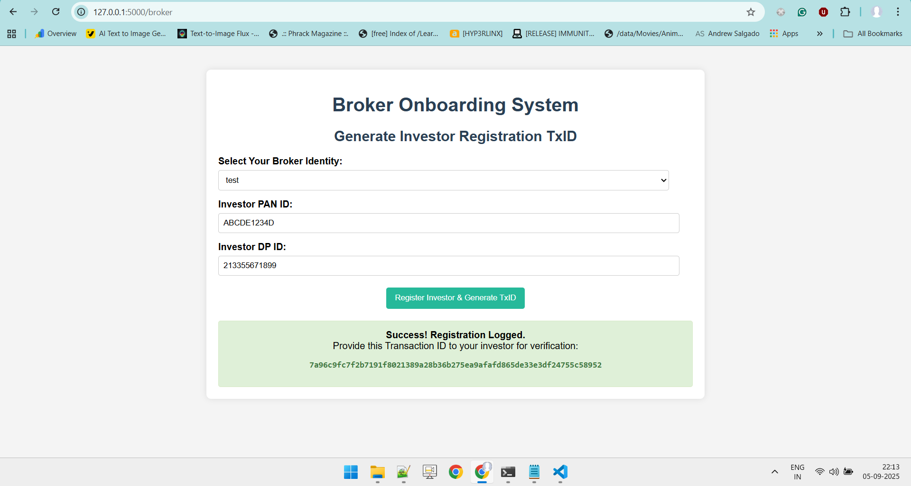
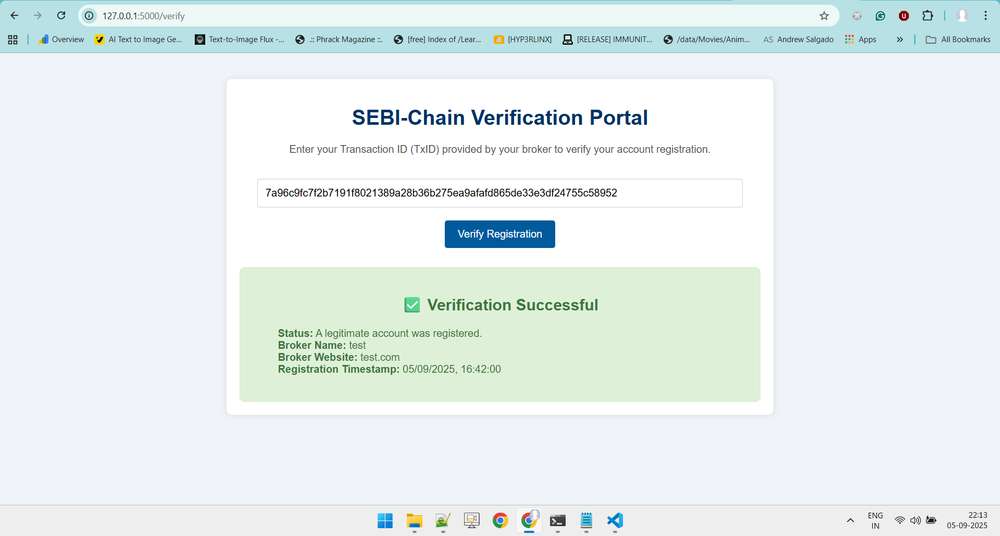
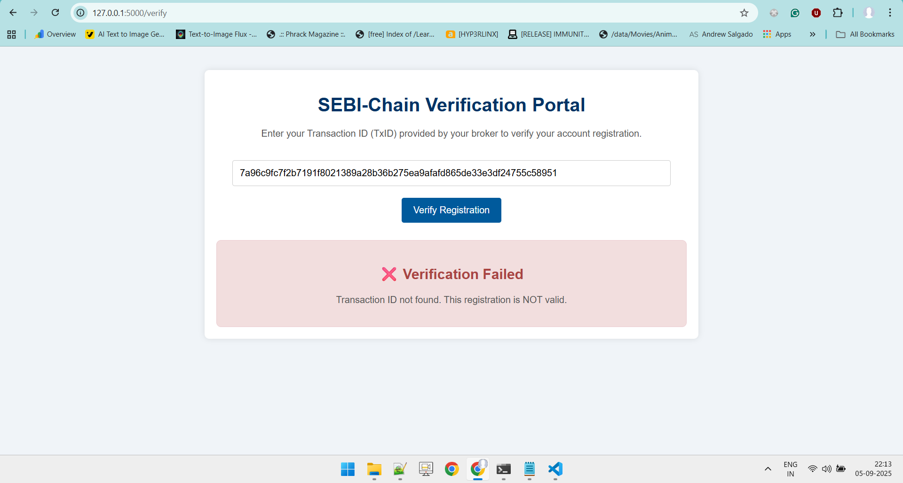

# SEBI-Chain MVP: Investor-Broker Verification System

This project is a functional Minimum Viable Product (MVP) demonstrating a secure system for verifying investor-broker relationships using public-key cryptography. It provides a client-server application built with Python (Flask) and a local SQLite database, simulating the entire workflow from broker registration to investor verification.

The core idea is to combat fraud from fake trading apps and impersonating advisors by giving investors an undeniable, cryptographic proof (a Transaction ID) that their account was legitimately created by a SEBI-registered broker.

## Setup and Installation

Follow these steps to get the application running locally.

### 1. Prerequisites
*   Python 3.6+
*   `pip` (Python package installer)

### 2. Install Dependencies
Open your terminal or command prompt, navigate to the `sebi_chain_mvp` project folder, and run the following command to install the required Python libraries:
```bash
pip install Flask ecdsa
```

### 3. Run the Application
Once the dependencies are installed, run the Flask server with this command:
```bash
python app.py
```
The server will start, and you will see output similar to this:
```
 * Running on http://127.0.0.1:5000
```
The application is now live and accessible in your web browser.

---

## Demo Walkthrough

Follow this guide to test the complete workflow.

### Step 1: Register a Broker (SEBI Admin)

First, we need to act as a SEBI official to register a legitimate broker.

1.  Open your web browser and navigate to the SEBI Admin Portal: **`http://127.0.0.1:5000/`**
2.  In the form, enter the following details:
    *   **Broker Name:** `test`
    *   **Broker Website:** `test.com`
3.  Click the **Register Broker** button. You will see an alert confirming the registration, and the broker will appear in the "Registered Brokers List".



### Step 2: Register an Investor (Broker)

Now, we act as the newly registered broker to onboard a new investor.

1.  Navigate to the Broker Portal: **`http://127.0.0.1:5000/broker`**
2.  From the dropdown, select your broker identity: **test**.
3.  Enter the investor's details:
    *   **Investor PAN ID:** `ABCDE1234D`
    *   **Investor DP ID:** `213355671899`
4.  Click the **Register Investor & Generate TxID** button.
5.  A green box will appear with a unique Transaction ID (TxID). **Copy this entire TxID string** for the next step.



### Step 3: Successful Verification (Investor)

As an investor who has just received a TxID, you can now verify its authenticity.

1.  Navigate to the public SEBI Verification Portal: **`http://127.0.0.1:5000/verify`**
2.  Paste the **exact TxID** you copied from the broker page into the input field.
3.  Click the **Verify Registration** button.
4.  You will see a **green success message** confirming that the registration is valid and displaying the details of the 'test' broker who created it. This proves your account is legitimate.



### Step 4: Failed Verification (Fraud Simulation)

Finally, let's see what happens if the TxID is fraudulent or has been tampered with.

1.  Go back to the verification page: **`http://127.0.0.1:5000/verify`**
2.  Paste the same TxID again, but **change just one character**. For example, change the last digit from `2` to `1`.
3.  Click the **Verify Registration** button.
4.  You will now see a **red failure message**. This demonstrates the system's security—even the slightest change invalidates the cryptographic signature, proving that the TxID is not authentic. The system correctly identifies it as either fraudulent or invalid.

